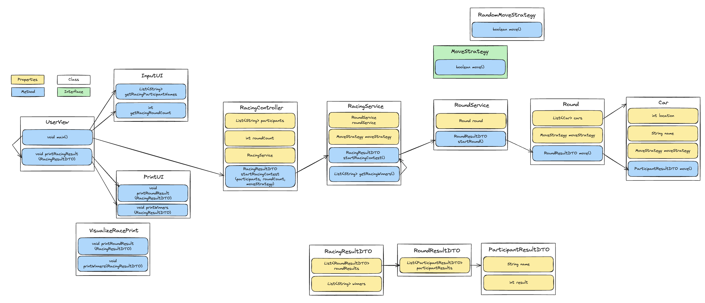

## 기능 요구사항
- 각 자동차에 이름을 부여할 수 있다. 자동차 이름은 5자를 초과할 수 없다.
- 전진하는 자동차를 출력할 때 자동차 이름을 같이 출력한다.
- 자동차 이름은 쉼표(,)를 기준으로 구분한다.
- 자동차 경주 게임을 완료한 후 누가 우승했는지를 알려준다. 우승자는 한명 이상일 수 있다.

## 프로그래밍 요구사항
- indent(인덴트, 들여쓰기) depth를 2를 넘지 않도록 구현한다. 1까지만 허용한다.
  - 예를 들어 while문 안에 if문이 있으면 들여쓰기는 2이다. 
  - 힌트: indent(인덴트, 들여쓰기) depth를 줄이는 좋은 방법은 함수(또는 메소드)를 분리하면 된다. 
- 함수(또는 메소드)의 길이가 15라인을 넘어가지 않도록 구현한다. 
  - 함수(또는 메소드)가 한 가지 일만 잘 하도록 구현한다. 
- 모든 로직에 단위 테스트를 구현한다. 단, UI(System.out, System.in) 로직은 제외 
  - 핵심 로직을 구현하는 코드와 UI를 담당하는 로직을 구분한다. 
  - UI 로직을 InputView, ResultView와 같은 클래스를 추가해 분리한다. 
- 자바 코드 컨벤션을 지키면서 프로그래밍한다. 
  - 참고문서: https://google.github.io/styleguide/javaguide.html 또는 https://myeonguni.tistory.com/1596
- else 예약어를 쓰지 않는다. 
  - 힌트: if 조건절에서 값을 return하는 방식으로 구현하면 else를 사용하지 않아도 된다. 
  - else를 쓰지 말라고 하니 switch/case로 구현하는 경우가 있는데 switch/case도 허용하지 않는다.

## 기능 목록 및 commit 로그 요구사항
- 기능을 구현하기 전에 README.md 파일에 구현할 기능 목록을 정리해 추가한다.
- git의 commit 단위는 앞 단계에서 README.md 파일에 정리한 기능 목록 단위로 추가한다.

## 기능 목록

### class Car
- [x] `METHOD` `move()` : 움직임을 시도한다.

### class Round
- [x] `METHOD` `move()` : 각 자동차들의 움직임을 시도한다.

### class RoundService
- [ ] `METHOD` `startRound()` : 한 라운드를 시작한다.

### class RacingService
- [ ] `METHOD` `startRacingContest()` : 자동차 경주를 시작한다.
- [ ] `METHOD(private)` `getWinners` : 우승자를 구한다.

### class RacingController
- [ ] `METHOD` `startRacingContest()` : 자동차 경주를 시작한다.

### class InputUI
- [ ] `method` `getCarsNumberInput()` :
  - "자동차 대수는 몇 대 인가요?"를 출력한다.
  - 입력값을 받는다.
  - 받은 입력값을 `int`로 반환한다.
- [ ] `method` `getRoundsNumberInput()` :
  - "시도할 회수는 몇 회 인가요?"를 출력한다.
  - 입력값을 받는다.
  - 받은 입력값을 `int`로 반환한다.

### class PrintUI
- [ ] `METHOD` `printRoundResult` : 라운드의 결과를 출력한다.
- [ ] `METHOD` `printWinners` : 우승자를 출력한다.

### interface MoveStrategy
- [x] `METHOD` `move()` : 이동 전략을 결정한다.

### interface PrintStrategy
- [ ] `METHOD` `printRoundResult` : 라운드 출력 전략을 결정한다.
- [ ] `METHOD(default)` `printWinners` : 우승자 출력한다.